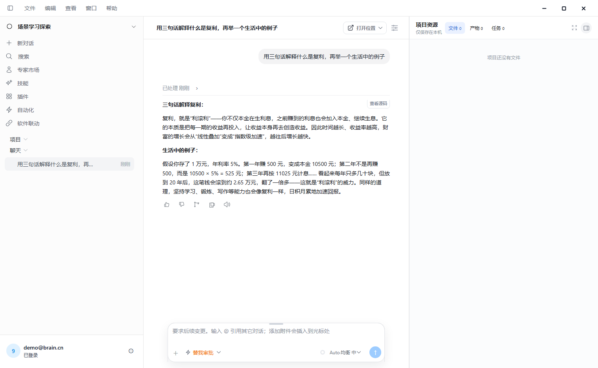
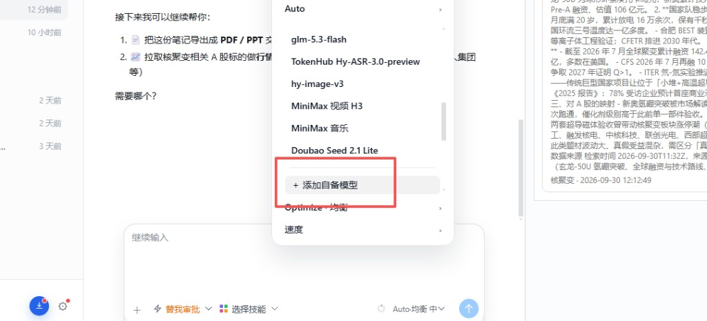

<p align="center">
  <a href="README.en.md"><b>English</b></a>
  &nbsp;·&nbsp;
  简体中文
</p>

<p align="center">
  
  
  
  
</p>

<h1 align="center">NewBrian</h1>

<p align="center">
  <b>免费的本地 AI 工作台。</b><br>
  在输入框写下内容并发送，就是一次操作。
</p>

<p align="center">
  <a href="https://www.sinnauze.cn/"></a>
  &nbsp;
  <a href="https://www.sinnauze.cn/app/download"></a>
</p>

<p align="center">
  
</p>

<p align="center">
  <sub>登录后的官方模型由 sinnauze 接收并完成这次操作。</sub>
</p>

---

## 一眼看完

<table>
  <tr>
    <td width="50%" valign="top">
      <h3>免费使用</h3>
      桌面可以免费使用。打开、写下、发送，安装包不单独收费。
    </td>
    <td width="50%" valign="top">
      <h3>官方模型走 sinnauze</h3>
      登录之后，官方模型由 sinnauze 接收并完成这次操作。
    </td>
  </tr>
  <tr>
    <td width="50%" valign="top">
      <h3>一把钥匙，四件工具</h3>
      配置 API Key 后，同一把钥匙接到 Codex、Claude Code、Cursor、OpenClaw。
    </td>
    <td width="50%" valign="top">
      <h3>自备模型留在本机</h3>
      自己的 OpenAI 兼容接口直接请求你填写的地址，钥匙只留在本机。
    </td>
  </tr>
</table>

## 基本功能

同一套桌面完成这些事。左上角切换场景后，项目、对话和右侧工具一起换。

| 功能 | 做什么 |
| --- | --- |
| 发送 | 在输入框写下内容并发送，就是一次操作。 |
| 项目 | 一个持续目标，下面挂着文件、对话、产物和任务。 |
| 右侧面板 | 文件、产物、任务始终在。进入场景后，再出现这个场景自己的工具。 |
| 官方模型 | 登录后，由 sinnauze 接收并完成这次操作。 |
| 自备模型 | 文字对话直接请求你填写的地址，钥匙只留在本机。图片、视频和语音仍走官方模型。 |

还没进入专业场景时，用的是场景学习探索：右侧只保留文件、产物和任务。

## 七个场景

| 场景 | 用来做什么 |
| --- | --- |
| 量化交易 | 查询行情、看 K 线和成交量、做模拟组合、写研究笔记。不连接真实券商，不执行真实下单。 |
| 游戏制作 | 管理关卡、角色、世界观、战斗设计和项目资产，并做试玩。 |
| 视频制作 | 写脚本、排分镜、生成单镜、编辑音视频轨，再合成导出。 |
| 音乐创作 | 写歌词、定风格、生成整曲、编排音轨，再导出音频。 |
| 数据与决策 | 导入 CSV 或 Excel，看表格、做摘要和图表，再写出分析结论。 |
| 软件与自动化 | 查看项目文件、改代码、跑受控终端、执行测试和部署，并编排自动化 Flow。 |
| 文档创作 | 写文稿、审校批注、排大纲和 PPT，再导出文档。 |

## 配置 API Key

sinnauze 用户配置 API Key 后，可以把同一把钥匙接到下面这些工具。

<p align="center">
  
  
  
  
</p>

## 配置自备大模型

官方模型不用自己填钥匙。要改用自己的 OpenAI 兼容接口：

1. 点输入框右侧的模型按钮，例如 `Auto·均衡 中`。
2. 打开模型列表，点 **＋ 添加自备模型**。
3. 填写显示名、Base URL、API Key、模型 ID，然后保存。
4. 选中带「自备」的那一行。之后的文字对话会直接请求这个地址，钥匙只留在本机。

图片、视频和语音仍使用官方模型。

<p align="center">
  
</p>

## 后期：国外大模型额度

> 后期会加入国外大模型。看广告可以获得赠送金额，再用这笔金额兑换国外大模型的使用额度。这项还没开放。现在可以配置自备模型，也可以在登录后使用官方模型。

## 从源码打包

`rust/brain-core` 源码不在这个仓库里。打包前在 `rust-core-release.json` 填好官方程序的 url 和 sha256。脚本会下载并核对，不一致就停止。

先安装依赖：

```bash
pnpm install
```

| 系统 | 命令 |
| --- | --- |
| Windows | `pnpm package:windows:production` |
| macOS Apple Silicon | `pnpm package:macos-arm64` |
| macOS Intel | `pnpm package:macos-x64` |
| Ubuntu x64 | `pnpm package:ubuntu-x64` |
| Ubuntu arm64 | `pnpm package:ubuntu-arm64` |

这些命令会生成对应系统的工程，下载官方 brain-core，再打安装包。公开源码使用 MIT 许可。brain-core 程序只允许原样随安装包分发。
