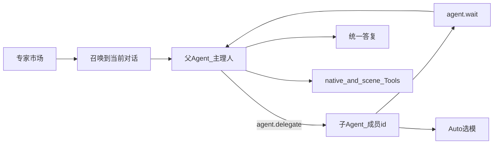

# BRAIN Expert Marketplace v1

> Status: **implemented baseline (cross-platform shared core)**   

> Parent: [brain-product-architecture.md](./brain-product-architecture.md)  
> Related: [unified-capability-runtime-v1.md](./unified-capability-runtime-v1.md), [brain-scene-tools-v1.md](./brain-scene-tools-v1.md)

## 0. 一句话

**专家市场把「可浏览/可安装/可召唤的领域专家品牌」产品化；运行时仍是 BRAIN 既有 `agent.delegate` → `agent.wait` + Auto 选模 + 场景 Tools，不引入 WorkBuddy TeamCreate/SendMessage。**

## 1. 产品语义

| 概念 | BRAIN 含义 |
|------|------------|
| 专家市场 | 一等入口（FeatureTab `experts`）：分类、卡片、安装、召唤 |
| 单专家 | 主理人设 + 领域 Skill + 委派偏好 |
| 专家团 | 具名 `memberAgents[]`，通过 `agent.delegate(role=<member-id>)` 拉起 |
| 召唤 | 绑定当前 thread：注入主理人 SOP、优先启用关联 Skill、关闭通用 Auto 强委派 |

## 2. 包格式（ExpertPack）

源码目录：`shared/apps/desktop/resources/experts/<id>/`

- `.codex-plugin/plugin.json`：市场元数据（profession、tags、quickPrompts、teamInfo…）
- `agents/*.md`：主理人 / 成员人设与 SOP（协作动作写 `agent.delegate` / `agent.wait`）
- `skills/*/SKILL.md`：可执行领域流程

安装态：`~/.newbrain/experts/installed/` + `~/.newbrain/experts/registry.json`（含 thread→expert 召唤映射）。

打包：Windows `extraResources` 复制到 `resources/experts`。

## 3. 运行时映射

| WorkBuddy 概念 | BRAIN 映射 |
|----------------|------------|
| TeamCreate / SendMessage | **禁止**；改为 delegate/wait |
| 圆桌成员 | `memberAgents` → `normalizeDelegationRequest(..., { allowedExtraRoles })` |
| 专家 Skill | 召唤时 `addSkillRoots(expert/skills)` + 技能名优先于普通 Composer Skill |
| Auto 强委派 | `expertSummonActive` 时关闭 planner 强制委派，改走专家 SOP |
| preferredWorkspaceKey | 提示切换场景，不强制打断 |

关键代码：

- `shared/apps/desktop/src/main/expert-marketplace.ts`
- `shared/apps/desktop/src/main/expert-marketplace-ipc.ts`
- `shared/apps/desktop/src/main/agent-collaboration.ts`
- `shared/apps/desktop/src/main/auto-orchestrator-policy.ts`
- `shared/apps/desktop/src/main/model-chat-service.ts` / `model-chat-prompt-policy.ts`
- Holon 运行时核心（跨平台）：`shared/apps/desktop/src/main/holon-*.ts|js`、`learning-ipc.ts`、`remote-event-sanitizer.js`
- UI：`ExpertsMarketplace.tsx` + `HolonWorkspace.tsx` + Composer 专家芯片

IPC（三端 protocol）：`experts:list|install|set-enabled|summon|clear-summon|get-summon`；Holon/learning 通道同属 protocol，平台入口接线仍在各 OS `main/index.ts` / preload。

## 3.1 Skill ↔ 专家桥接

**召唤只有一种方式：已启用的全局/项目 Skill 自行调用 `expert.summon`。**

1. **专家市场页**：只浏览 / 安装 / 启用专家包，**无 UI 召唤按钮**。
2. **Skill 建议**：`SKILL.md` 的 `expert: <id>` 仅为建议；选中 Skill 不会自动召唤。
3. **Skill 自行决定**：本回合需要专家人设/团员委派时，调用 `expert.list` / `expert.summon` / `expert.clear`；寒暄与简单一步题不要召唤。
4. **Composer**：仅在 Skill 已召唤后显示状态芯片（可取消），不再提供「去市场召唤」入口。

专家仍不替代 native/场景 Tools；只增强人设与具名 `agent.delegate`。

## 4. v1 种子

### 4.1 计划 C 表（10 个）

1. software-delivery-team（团）
2. senior-developer
3. frontend-developer
4. wechat-miniprogram-developer
5. ui-designer
6. data-analytics-reporter
7. content-creator
8. equity-research
9. ppt-creation-expert
10. long-document-writer

### 4.2 场景补强（GitHub 方法论改编 · 4 个）

| id | 场景 | 说明 |
|---|---|---|
| `game-studios-delivery` | game | 已有包上架打磨；灵感 Claude-Code-Game-Studios（MIT） |
| `ai-film-production` | video | 导演/分镜/短剧生产；灵感 ai-film-skills 等（自写改编） |
| `music-composer` | music | 多轨编曲与符号音乐；灵感 BeatFlow 等（自写改编，不 vendor GPL 引擎） |
| `quant-backtest` | quant / data | 截面回测协议与健康度；灵感 quantskills/skill-backtest（自写改编） |

不含：政务写作、生活向（美团等）、原样上架 444 个 WB 云端专家、整仓复制 GPL Skill 正文。

## 5. 红线

- 不移植 WorkBuddy Team 运行时
- 不绕过审批 / path-security / 场景 Tools
- 专家包不私自钉死公司模型密钥路径
- Skill/专家只加领域规则，不替换 native Tools

## 6. 平台状态

- **Windows**：主进程 IPC、召唤注入、delegate 角色扩展、打包 resources 已接线
- **macOS / Ubuntu**：protocol FeatureTab 入口已对齐；主进程召唤接线按 Windows 同模式补齐（共享逻辑已在 `shared/`）

## 7. 验收要点

1. 专家市场能列出计划 C 10 席 + 场景补强席（game/video/music/quant-backtest）
2. Skill 可通过 `expert.summon` 召唤；Composer 显示专家芯片（市场页无召唤按钮）
3. 专家团成员 role 可通过 `agent.delegate` 下达，不会静默掉成 `researcher`
4. 召唤期间不再强制 Auto「必须先 delegate 给 planner…」
5. 取消召唤后行为回到通用 Auto
6. 各专家 `preferredWorkspaceKey` / `workspaceKeys` 与场景过滤一致
