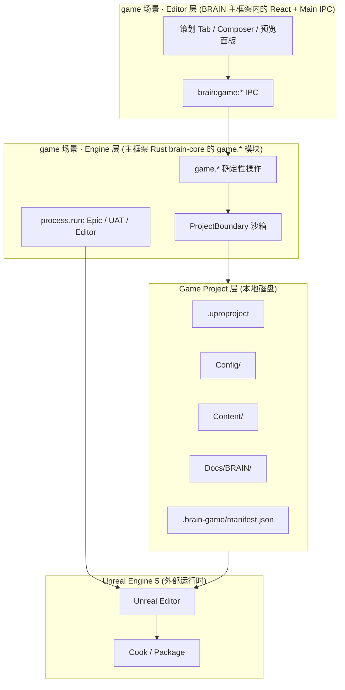
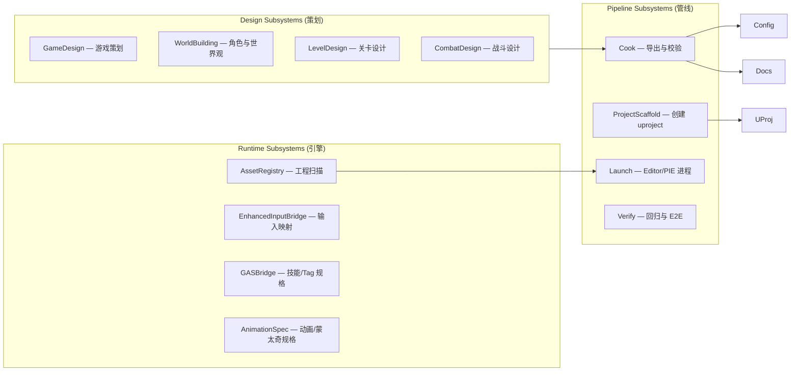
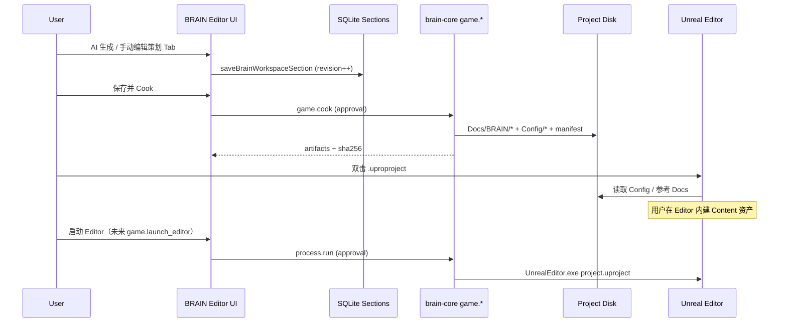

# BRAIN Game Runtime v1 — UE5-Inspired Architecture

> Status: **approved baseline** for **game 场景 Tools 子架构**（非 BRAIN 主框架替代物）。  
> Parent: [brain-scene-tools-v1.md](./brain-scene-tools-v1.md) → [brain-product-architecture.md](./brain-product-architecture.md)  
> Supersedes ad-hoc TS-only template helpers as the source of truth.  
> Related: [workspace-architecture.md](../product/workspace-architecture.md), [unified-capability-runtime-v1.md](./unified-capability-runtime-v1.md)

## 0. 在 BRAIN 中的位置

```text
BRAIN 主框架
└─ 七场景 Tools 子架构
   └─ game（游戏制作, workspaceKey = "game"）   ← 本文档
      ├─ 继承：项目 / 对话 / Composer / Rust Core / 能力运行时
      ├─ 扩展：策划四 Tab、GameWorkspace、game.* IPC
      └─ 外部 Engine：UE5（主）· Web · Godot · Unity
```

| 层 | 包/路径 | 说明 |
|----|---------|------|
| 主框架 UI 壳 | `WorkspaceModules.tsx` | 切换七场景；game 只是其中一个 Tab 树 |
| game 子架构 UI | `GameWorkspace.tsx`, `GameDesignPanel.tsx`, … | 仅 `brainWorkspaceKey === "game"` 时加载 |
| game 子架构 IPC | `brain:game:*` | 见 `brain-workspace.ts` |
| game 子架构 Engine | `rust/brain-core/src/game/` | `game.inspect`, `game.cook`, … |
| 外部 UE5 | Epic / `.uproproject` | **不属于 BRAIN 仓库**；game 子架构对接 |

**不得** 把 UE5 模块图当成 BRAIN 全局架构；**只能** 作为 game 场景的参考实现。

---

## 1. Role split（对标 UE5 三角 · 仅在 game 场景内）

UE5 产品由 **Engine（运行时）**、**Editor（创作工具）**、**Project（磁盘资产）** 三者组成。  
BRAIN 游戏工作台采用同构拆分，避免「聊天框 + 临时写文件脚本」的补丁模式。



| UE5 概念 | game 子架构中的 BRAIN 对应 | 职责 |
|----------|----------------------------|------|
| **Unreal Engine** | **主框架 Rust `brain-core` 的 `game.*`** | 确定性、可审计、有边界地操作工程与进程 |
| **Unreal Editor** | **主框架 Electron + game 面板** | 人机协作、AI 生成、可视化编辑、审批 |
| **`.uproproject`** | **`.uproproject` + `.brain-game/manifest.json`** | 引擎识别 + BRAIN 元数据与 Cook 记录 |
| **`Content/`** | **`Content/`**（用户/AI 在 Editor 中创建） | 关卡、Blueprint、Input、GAS 资产 |
| **`Config/`** | **`Config/`**（由 Cook 从策划生成） | `DefaultInput.ini`, `DefaultGameplayTags.ini` 等 |
| **`Source/`** | **`Source/`**（可选 C++ 模块） | 长期由模板脚手架生成，非 v1 二进制资产 |
| **`Saved/` / `Intermediate/`** | **不纳入版本库** | 与 UE 规范一致，inspect 忽略 |
| **Editor-only 数据** | **SQLite `brain_workspace_section`** | 策划草稿；**必须 Cook 后才进 Project** |
| **PIE (Play In Editor)** | **`game.preview` / 未来 `game.launch_editor`** | 试玩验证；需用户审批 |
| **Cook** | **`game.cook`** | 策划 + Config 导出 + manifest 哈希 |
| **Package** | **发布工件（CI / 可选 UAT）** | Phase 4+ |

**原则：** SQLite 里是 **Editor 草稿**；磁盘上是 **可交付工程**；UE5 是 **最终运行时**。三者不混用。

---

## 2. UE5 功能域 → BRAIN 子系统映射

UE5 用 **Module + Subsystem + Plugin** 组织功能。BRAIN 游戏工作台用 **命名子系统 + Rust operation + IPC** 对齐。

### 2.1 子系统总览



| UE5 功能 | BRAIN 子系统 | 用户可见 | 持久化 |
|----------|--------------|----------|--------|
| Project Settings / Maps & Modes | `ProjectScaffold` | 创建 UE5 工程向导 | `.uproproject`, `Config/` |
| Content Browser | `AssetRegistry` (`game.inspect`) | 资产与测速 Tab | 只读扫描 |
| World Settings / Data Layers | `Design` 四 Tab | 游戏策划/世界观/关卡/战斗 | SQLite → Cook → `Docs/BRAIN/` |
| Enhanced Input | `EnhancedInputBridge` | 战斗 Tab + Cook 输出 | `Config/DefaultInput.ini`, `input-mapping.json` |
| Gameplay Tags + GAS | `GASBridge` | 战斗 Tab | `Config/DefaultGameplayTags.ini`, `combat.json` |
| Animation Blueprint（规格） | `AnimationSpec` | 战斗/关卡 Tab 引用的 Montage 表 | `Docs/BRAIN/animation-spec.json` |
| Skeleton / Retarget（规格） | `WorldBuilding` + 文档 | 角色 Tab | `Docs/BRAIN/world.json` |
| Level Editor（规格） | `LevelDesign` | 关卡 Tab · **Actor 树** · Content/Outliner **选项卡** · AI 放置 **敌人 / Boss / NPC** | SQLite → Cook → `Docs/BRAIN/level.json` + `Content/` 规格 |
| PIE | `Launch.preview` | Web 试玩 / 未来 UE PIE | 进程态 |
| Editor 启动 | `Launch.editor` | Epic 引导 + 启动 Editor | `process.run` |
| Cook / Staging | `Cook` | 「导出/Cook 到工程」 | `manifest.json` 哈希链 |

---

## 3. 磁盘工程布局（与 UE5 对齐）

绑定本地目录后，**Game Project** 标准布局：

```text
{ProjectRoot}/
├── {ProjectName}.uproproject      # UE5 入口（EngineAssociation 与 Epic 安装一致）
├── .brain-game/
│   ├── manifest.json              # BRAIN Cook 记录、revision、sha256
│   ├── pipeline.json              # 管线版本 brain-game-runtime-v1
│   └── editor-state.json          # 可选：上次 Editor 路径、引擎版本探测
├── Config/
│   ├── DefaultEngine.ini          # 由 Cook 模板 + 策划覆盖
│   ├── DefaultGame.ini
│   ├── DefaultInput.ini           # Enhanced Input 基线
│   └── DefaultGameplayTags.ini    # GAS Tag 基线
├── Content/                       # UE Editor 内创建 .uasset（BRAIN 不生成二进制）
│   ├── _Core/
│   │   ├── Input/                 # IA_ / IMC_（Editor 内建）
│   │   ├── GameMode/
│   │   └── Characters/
│   ├── Maps/
│   └── README.md                  # BRAIN 生成的占位说明
└── Docs/
    └── BRAIN/                     # Cook 产物（策划正文，UE 可读）
        ├── design.md              # 游戏策划（Markdown）
        ├── world.json             # 角色与世界观
        ├── level.json             # 关卡设计
        ├── combat.json            # 战斗设计
        ├── input-mapping.json     # Enhanced Input 对照（派生自 combat）
        ├── animation-spec.json    # Montage / Notify 帧表（派生）
        ├── ue5-architecture.md    # 团队实现指引
        └── manifest.json          # 与 .brain-game 同步的导出清单
```

**与 UE5 一致：** `Content/` 放资产，`Config/` 放 ini，`Docs/BRAIN/` 相当于 **Design Documentation + DataTable 源**（CSV/JSON），Editor 内人工或 Utility Script 导入为 DataTable。

---

## 4. 数据流：AI 生成 → 手动调整 → Cook → UE5 打开



### 4.1 Editor 草稿（SQLite）

| section_key | 格式 | 对标 UE5 |
|-------------|------|----------|
| `design` | Markdown | GDD / Project Description |
| `world` | JSON fields | Lore Bible / Character Sheet |
| `level` | JSON fields | Level Design Doc |
| `combat` | JSON fields | Combat Spec + Input + GAS |

**Revision / 冲突：** 与现有 `BRAIN_WORKSPACE_SECTION_CONFLICT` 一致，对标 UE **Source Control checkout**。

### 4.2 Cook（`game.cook`）

Cook 是 **唯一** 从 Editor 草稿进入 Project 磁盘的主路径（禁止静默双写）。

Cook 步骤（Rust 内原子执行）：

1. 读取 payload 中的 sections（由 Main 从 SQLite 组装）
2. 校验 JSON schema / 大小边界
3. 写入 `Docs/BRAIN/*`（临时文件 → rename）
4. 派生 `input-mapping.json`, `animation-spec.json`
5. 合并/写入 `Config/*.ini` 模板
6. 更新 `.brain-game/manifest.json`（revision + sha256 列表）
7. 返回 `artifacts[]` 供 UI 与 E2E 验收

### 4.3 打开 UE5

- **v1：** 用户 Epic Launcher → 打开 `.uproproject`（BRAIN 提供 `game.inspect` + Epic 检测）
- **v2：** `game.launch_editor` → `process.run` 调 `UnrealEditor.exe`（强审批）
- **v3：** `game.cook_staging` + UAT（CI 包）

---

## 5. Rust `brain-core` 操作目录（Engine 层）

所有 **改变工程磁盘** 的操作必须在 Rust 执行，走 `ProjectBoundary` + `approval_token`。

| Operation | 审批 | 说明 |
|-----------|------|------|
| `game.inspect` | 否 | 有界目录扫描；返回 engine/markers/assets（替代 TS 双轨 inspector） |
| `game.scaffold_web` | 是 | Web 小游戏脚手架 |
| `game.scaffold_unreal` | 是 | 创建 `.uproproject` + `Config/` + 目录树 |
| `game.cook` | 是 | SQLite sections → `Docs/BRAIN` + Config + manifest |
| `game.launch_editor` | 是 | 启动 Unreal Editor（需解析 Epic 安装路径） |
| `game.launch_uat` | 是 | Phase 4：Cook + Package 命令行 |

只读操作不走 approval；写操作与 `file.write` 同级信任模型。

协议字段见 `shared/packages/protocol/src/brain-game-runtime.ts`。

---

## 6. 「GAS + Enhanced Input」在 BRAIN 中的含义

BRAIN **不实现** UE 的 GAS 运行时；实现 **GAS 规格层（Spec）**，供 Editor 内人工/脚本落地。

### 6.1 Gameplay Tags（Config 驱动）

Cook 写入 `DefaultGameplayTags.ini` 基线：

```ini
Ability.Attack.Light, Ability.Attack.Heavy, Input.Attack.Light, State.Attacking, ...
```

与 `combat.json` 中 `playerActions` / `enemyMechanics` 字段对应。

### 6.2 Enhanced Input（Config + JSON 驱动）

| 层 | 位置 |
|----|------|
| 规格 | `Docs/BRAIN/input-mapping.json` |
| 引擎配置 | `Config/DefaultInput.ini` |
| 资产 | `Content/_Core/Input/`（Editor 创建 `IA_*`, `IMC_*`） |

Composer AI 生成策划时，system prompt 引用 **Input Tag ↔ IA ↔ 手柄键** 对照表（见 playbook）。

### 6.3 Animation Spec（Montage 帧表）

`animation-spec.json` 由 `combat.json` 派生：

```json
{
  "montages": [
    {
      "id": "AM_LightAttack",
      "slot": "DefaultSlot",
      "notifies": [
        { "frame": 10, "name": "EnableWeaponTrace" },
        { "frame": 14, "name": "DisableWeaponTrace" }
      ]
    }
  ]
}
```

对标 UE **AnimMontage + AnimNotify**；实现仍在 Editor。

---

## 7. AI 在架构中的位置（Instruction + Builtin）

对齐 [unified-capability-runtime-v1.md](./unified-capability-runtime-v1.md)：

| 步骤 | Provider | 行为 |
|------|----------|------|
| 用户「生成关卡设计」 | `instruction` | 模型生成 JSON 草稿 |
| 写入 SQLite | `builtin` (IPC) | `saveBrainWorkspaceSection` |
| 用户「Cook 到工程」 | `builtin` (Rust) | `game.cook` |
| 用户「创建 UE 工程」 | `builtin` (Rust) | `game.scaffold_unreal` |
| 用户「帮我在 Content 写 BP」 | `instruction` + agentd `workspace.write_file` | 仅文本/脚本；**不伪造 .uasset** |
| 启动 Editor | `process` | `game.launch_editor` + 审批 |

**禁止：** AI 直接写 SQLite 与磁盘双份不一致；**必须** 经 Cook 落盘。

---

## 8. 明确不做（边界）

| 能力 | 原因 | 替代 |
|------|------|------|
| 生成 `.uasset` / `.umap` 二进制 | 无 UE Editor API | Cook JSON/MD + Editor 内创建 |
| 绑骨 / 权重 / FBX 写回 | DCC 工具链 | 文档 + 导出规范 |
| 替代 Unreal Editor | 产品边界 | 启动 Editor |
| TS 主进程直接写 uproject | 双轨不安全 | Rust `game.*` |
| 自动 Cook 每次保存 | 用户失控 | 显式「Cook」按钮 |

---

## 9. 与现有代码的迁移路径

| 现状 | 目标 |
|------|------|
| `game-template-service.ts` 写盘 | **删除写盘逻辑**；TS 仅 IPC → Rust |
| `game-project-inspector.ts` | **`game.inspect` Rust 单一实现**；TS 薄封装 |
| SQLite sections only | 保留 Editor 草稿；**Cook 进 Docs/BRAIN** |
| `GameDesignPanel` / `WorkspaceSectionEditor` | 保持 UI；增加 **Cook** / **同步到工程** |
| `generateBrainWorkspaceSection` | 生成后提示用户 Cook；prompt 引用磁盘布局 |

### 实施阶段

| Phase | 交付 | 验收 |
|-------|------|------|
| **P0 合同** | 本文 + `brain-game-runtime.ts` + Rust `game_ops` 模块骨架 | 协议评审 |
| **P1 Engine** | `game.scaffold_unreal`, `game.cook`, `game.inspect` | Rust 单测 + manifest 哈希 |
| **P2 Editor** | UI：脚手架/Cook/inspect 走 Rust；去掉 TS 写盘 | E2E：UE 可打开 `.uproproject` |
| **P3 Launch** | `game.launch_editor`, Epic 路径发现 | 审批 + 进程边界测试 |
| **P4 Pipeline** | UAT、DataTable CSV、CI Cook | 可选；3A 团队 |

---

## 10. E2E 验收标准（长期）

1. 真实账号登录；**禁止** auth bypass 作为 PASS 依据  
2. 四 Tab AI 生成 → 用户改一字 → Cook → `manifest.revision` 正确  
3. 磁盘存在合法 `.uproproject`；`EngineAssociation` 匹配本机 Epic  
4. `Docs/BRAIN/design.md` 与 SQLite `design` content 一致（sha256）  
5. UE5 Editor 可打开工程（人工或 `launch_editor`）  
6. Web 小游戏路径与 UE 路径 **共用 Cook _manifest 模型**，引擎不同、管线同构  

---

## 11. 参考：UE5 模块与 BRAIN 目录对照

| UE5 Engine Module | BRAIN 实现位置 |
|-------------------|----------------|
| UnrealEd | `shared/apps/desktop/src/renderer/app/Game*.tsx` |
| Engine | `rust/brain-core/src/game_ops.rs` |
| GameplayAbilities | Cook → `DefaultGameplayTags.ini` + `combat.json` |
| EnhancedInput | Cook → `DefaultInput.ini` + `input-mapping.json` |
| AssetRegistry | `game.inspect` |
| Projects / UProject | `game.scaffold_unreal` |
| TargetPlatform / CookOnTheFly | Phase 4 `game.launch_uat` |

---

**Version:** `brain-game-runtime-v1`  
**Next review:** when adding `game.launch_uat` or binary asset import
