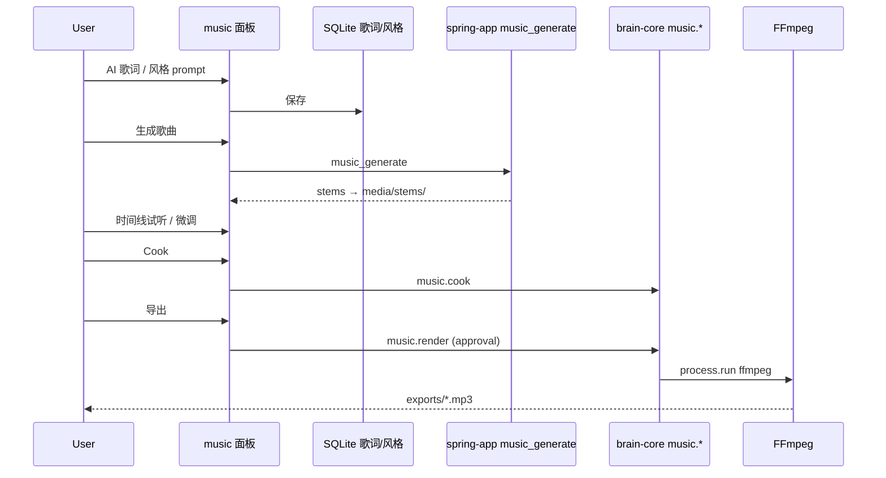

# BRAIN Music Runtime v1 — 音乐场景 Tools 子架构

> Status: **approved baseline** for **music 场景 Tools 子架构**  
> Parent: [brain-scene-tools-v1.md](./brain-scene-tools-v1.md)  
> Related: [brain-video-runtime-v1.md](./brain-video-runtime-v1.md)（同级 AI 生成管线模板）

## 0. 在 BRAIN 中的位置

```text
BRAIN 主框架
└─ 七场景 Tools 子架构
   └─ music（音乐创作, workspaceKey = "music"）   ← 本文档
      ├─ 继承：项目 / 对话 / Composer / Rust Core / 能力运行时
      ├─ 扩展：歌词 / 风格 / 分轨 / 时间线 / 试听 / 导出
      └─ 外部 Engine：spring-app **音乐生成 API**（主）· FFmpeg 混音/导出 · 可选本地 MusicGen
```

| 层 | 路径 | 说明 |
|----|------|------|
| 主框架 | `WorkspaceModules.tsx` | `brainWorkspaceKey === "music"` |
| music UI | `MusicWorkspace.tsx`, timeline / lyrics 面板 | 专业 Tab |
| music IPC | `brain:music:*` | `brain-workspace.ts` |
| AI 生成 | **`music.song.generate`**（场景 Tools；内部 `music_generate`） | 右侧 DAW「生成/音轨」+ spring-app |
| 合成 Engine | music render → **`process.run`** FFmpeg | 多轨混音、格式转换 |
| 规划 Rust 模块 | `rust/brain-core/src/music/`（待建） | `music.*` 统一前缀 |

**对标关系（AI 音乐生成框架，非传统 DAW）：**

| 主流 AI 音乐产品 / 框架 | 借鉴什么 | BRAIN 不做什么 |
|-------------------------|----------|----------------|
| **Suno**、**Udio** | 歌词 + 风格 prompt → **整曲生成** → 试听 → 迭代 | 不自建大模型训练 |
| **简化 DAW 时间线** | **多轨 stems**、**时间标记**、**切片选区**、片段重排后 **FFmpeg 重合成** | 不做 Logic/Ableton 级混音与 MIDI 卷帘 |
| **Stable Audio**、**MusicGen**（Meta） | 文本/片段 → 音频 clip；可本地 Comfy 节点 | 不做完整 Logic/Ableton UI |
| **ACE Studio** 等 AI 人声 | 歌词 → 演唱轨合成（未来 vocal 通道） | 不做专业修音台 |
| **Reaper/DAW 导出** | 多轨 **stem 落盘 + 简单混音** 概念 | 不做 MIDI 钢琴卷帘专业编辑 |
| **FFmpeg** | 多轨 **mix / loudnorm / 格式导出** | 不做母带插件链 |

BRAIN music = **AI 生成编排壳 + 歌词/风格草稿 + 时间线试听 + FFmpeg 导出**；Logic/FL Studio 仅可选 `launch_external`。

---

## 1. 参考模型（AI 音乐生成管线抽象）

| AI 音乐框架概念 | music 子架构 | 持久化 |
|-----------------|--------------|--------|
| Lyrics / Theme | 歌词 Tab + section | SQLite → Cook → `lyrics.md` |
| Style / Genre prompt | 风格 Panel | SQLite `style.json` |
| Song generation job | **`music_generate`**（spring-app，规划） | `media/stems/` + artifact |
| Reference audio | 音频素材 Tab | 项目目录 |
| Multi-track timeline | Music timeline service | SQLite / JSON |
| Preview / A-B | 试听播放器 | 内存 + 缓存 wav/mp3 |
| Mix / Export | `music.render` → FFmpeg；**可选格式** MP3 / WAV / FLAC / M4A / OGG（+ stems.zip） | `exports/*.{mp3,wav,flac,m4a,ogg}` |
| MIDI 精编 / 母带 | **不做** | 外部 DAW（可选 launch） |

---

## 2. 磁盘工程布局（Cook 后）

```text
{ProjectRoot}/
├── .brain-music/
│   ├── manifest.json
│   └── pipeline.json          # brain-music-runtime-v1
├── media/
│   ├── stems/                 # AI 生成轨 / 用户素材
│   └── references/
├── timeline/
│   └── timeline.json
├── exports/
│   └── render-{id}.mp3
└── Docs/
    └── BRAIN/
        ├── lyrics.md
        ├── style.json
        └── manifest.json
```

**原则：** 歌词/风格在 SQLite 为 **Editor 草稿**；**Cook** 后写入 `Docs/BRAIN` + manifest，与 video/game 同构。

---

## 3. Rust `music.*` 操作目录（目标态）

| Operation | 审批 | 现状 | 说明 |
|-----------|------|------|------|
| `music.inspect` | 否 | 无 | 扫描 stems、timeline 完整性 |
| `music.cook` | 是 | 无 | sections → `Docs/BRAIN` + manifest |
| `music.render` | 是 | 部分（timeline render） | 归口 FFmpeg 混音导出 |
| `music.probe` | 否 | 部分 | 时长、采样率、声道 |

---

## 4. 数据流



---

## 5. 与能力运行时

| 意图 | Provider |
|------|----------|
| 写歌词/风格 | instruction → SQLite |
| **生成歌曲/片段** | spring-app **`music_generate`**（与 video 对称，待网关） |
| Cook | builtin `music.cook` |
| 混音/导出 | process `music.render` → FFmpeg |
| 小说/TTS 配音 | 复用 `novel-tts` / gateway audio（跨场景） |

---

## 6. 实施阶段

| Phase | 交付 |
|-------|------|
| P0 ✅ | 本文 + 对标 AI 框架（Suno/Udio 管线） |
| P1 | spring **`music_generate`** 合同 + gateway 客户端 |
| P2 | `music.cook` + 歌词 Export UI |
| P3 | 时间线 → `music.render` 全归口 Rust |
| P4 | 可选 `music.launch_external`（Reaper/Logic） |

---

**Version:** `brain-music-runtime-v1`
