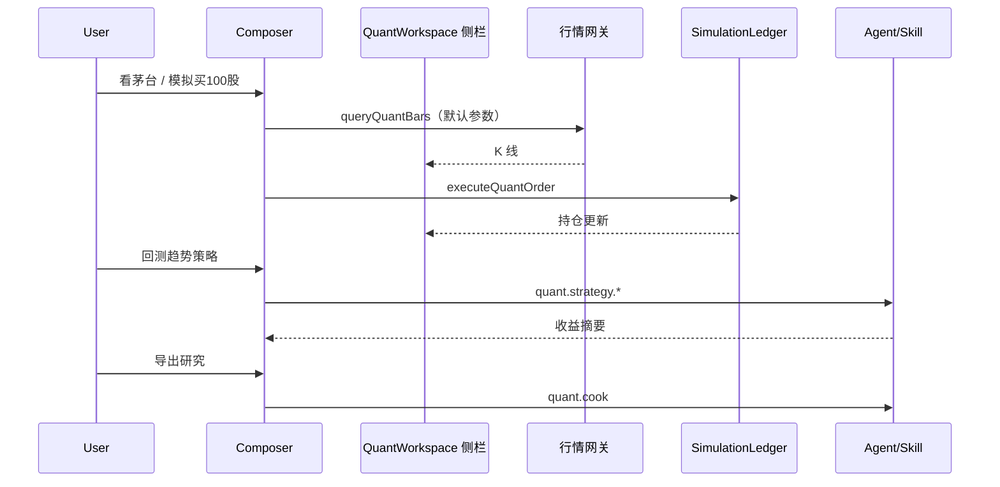

# BRAIN Quant Runtime v1 — 量化场景 Tools 子架构

> Status: **approved baseline** for **quant 场景 Tools 子架构**  
> Parent: [brain-scene-tools-v1.md](./brain-scene-tools-v1.md)  
> Related: [quant-market-data-contract.md](./quant-market-data-contract.md)

## 0. 在 BRAIN 中的位置

```text
BRAIN 主框架
└─ 七场景 Tools 子架构
   └─ quant（量化交易, workspaceKey = "quant"）   ← 本文档
      ├─ 继承：项目 / 对话 / Composer / Rust Core / 能力运行时
      ├─ 扩展：对话看股 · 模拟买卖 · AI 解读 · 后台策略（用户不可见复杂度）
      └─ 外部 Engine：行情网关 · 模拟账本 · Agent 回测（无 QuantConnect 式 IDE）
```

| 层 | 路径 | 说明 |
|----|------|------|
| 主框架 | `WorkspaceModules.tsx` + **Composer** | 量化 **主入口是对话**，不是多 Tab 终端 |
| quant UI | `QuantWorkspace.tsx`（compact 侧栏） | **结果面板**：K 线、持仓、一键模拟买卖 |
| quant IPC | `brain:quant:*` | 见 `brain-workspace.ts` |
| quant 域服务 | `quant-simulation-service.ts`, `market-data-service.ts` | Main TS；用户不直接接触 |
| 规划 Rust 模块 | `rust/brain-core/src/quant/`（待建） | `quant.*` 统一前缀 |

**对标关系（极简化操作，按现有原型演进）：**

| 用户侧对标 | 借鉴什么 | 明确不做 |
|------------|----------|----------|
| **同花顺问财 / 东方财富 AI** | 一句话看股、选股、读公告；**对话即操作** | 不做 Bloomberg 键盘流、Wind 多窗格 |
| **富途 / Robinhood 模拟盘** | 当前代码 → 看行情 → **模拟买/卖** 两三步 | 不接真实券商、不托管密钥 |
| **BRAIN Composer** | 「帮我看看茅台」「模拟买 100 股」由 Agent 调 IPC | 不让用户填 interval/复权/cron（默认或 Agent 推断） |

**分层原则：**

```text
用户可见：Composer 自然语言 + 侧栏卡片（代码、K 线、持仓、买卖按钮）
用户不可见：行情网关、SimulationLedger、Skill 回测、策略调度、Cook 落盘
```

专业能力（回测、雷达、多策略对比）= **Agent + Skill 后台跑**，结果以卡片/对话摘要呈现。

**主路径（必须可用）：**

1. 选择内置量化 Skill（`trend-following` / `mean-reversion`）或对话选定同名 Skill  
2. 「立即用 Skill 自动模拟」→ `runSkillSimulation` 按真 K 线逐日信号自动买卖  
3. 「组合」展示 **Skill 自动模拟组合**；手动买卖仅作对照盘  
4. 「雷达」把同一 Skill 挂到交易日定时任务  

手动点买卖 **不是** 量化交付主路径。

`QuantWorkspace` 的 strategy/radar Tab 展示 Skill 结果，**不是** QuantConnect/Zipline 式研究 IDE。

BRAIN 不是券商；**实盘下单** 永远不在 v1 范围。

**实施要求（必须完全可用，但交互极简）：**

| 能力 | 用户操作（验收） |
|------|------------------|
| 看股 | 对话说股票名/代码 **或** 侧栏改代码 → 自动出 K 线（默认日线前复权，无需手选） |
| 模拟盘 | 侧栏 **模拟买入/卖出** 或对话「买 100 股」→ 持仓/盈亏即时更新 |
| 解读 | 对话问「这票怎么样」→ AI 结合行情/公告摘要回答 |
| 策略/回测 | 对话「用趋势策略回测一下」→ Agent 跑 Skill → **对话 + 策略 Tab 摘要**，用户不写脚本 |
| Cook | 对话「导出研究笔记」或一键 Export → `Docs/BRAIN` |

未完成上表 **全部** 行，quant 子架构不算交付完成；**不得**以增加专业 Tab/表单来凑功能。

---

## 1. 参考模型（极简交互抽象）

| 用户动作 | quant 子架构 | 谁执行 |
|----------|--------------|--------|
| 「看茅台」 | Composer → `queryQuantBars`（默认参数） | Agent + 侧栏联动 |
| 「模拟买 100 股」 | `executeQuantOrder` | 对话或侧栏按钮 |
| 「这票能买吗」 | instruction + 行情 context | Agent 解读 |
| 「回测趋势策略」 | Skill + `quant.strategy.*` task | Agent 后台；用户看摘要 |
| 「每天收盘跑雷达」 | `createQuantStrategySchedule` | Agent 代填参数；用户只确认 |
| 导出研究 | `quant.cook` | 一键 / 对话 |

| 后台概念（用户不操作） | 实现 | 持久化 |
|------------------------|------|--------|
| Market data feed | `MarketDataService` + 网关 | 无密钥；见 market-data-contract |
| Paper trading | `SimulationLedger` | SQLite session JSON |
| Strategy / backtest | Skill + agentd | run 记录 → 摘要卡片 |
| Research note | section | SQLite → Cook → `Docs/BRAIN/research.md` |
| Live order | **禁止** | — |

---

## 2. 磁盘工程布局（Cook 后）

```text
{ProjectRoot}/
├── .brain-quant/
│   ├── manifest.json
│   ├── session.json           # 模拟盘状态（可 Cook 快照）
│   └── pipeline.json
├── data/
│   └── bars/                  # 可选本地缓存（网关拉取后）
├── strategies/
│   └── *.py / *.js            # 策略脚本（agent 写入）
└── Docs/
    └── BRAIN/
        ├── research.md        # 研究笔记 Cook
        ├── hypothesis.json    # 策略假设结构化
        └── backtest-report.json
```

---

## 3. Rust `quant.*` 操作目录（目标态）

| Operation | 审批 | 现状 | 说明 |
|-----------|------|------|------|
| `quant.inspect` | 否 | 无 | 扫描 data/、策略文件、session 完整性 |
| `quant.cook` | 是 | 无 | research section → `Docs/BRAIN` |
| `quant.backtest.run` | 是 | TS scheduler 部分 | 归口 Rust 计算边界 |
| `quant.session.export` | 是 | TS persist | 导出 session 快照 |
| `quant.report.generate` | 否 | 部分 | 组合曲线、指标 JSON |

**安全：** 行情网关 URL 在 Main 配置；**AKShare/供应商密钥 never in client**（已有 contract）。

---

## 4. 数据流



---

## 5. 与能力运行时

| 意图 | Provider |
|------|----------|
| 看股 / 换代码 | Composer → `queryQuantBars`（默认日线前复权） |
| 模拟买卖 | Composer 或侧栏 → `executeQuantOrder` |
| 解读公告/新闻 | instruction + 行情 context + 搜索网关 |
| 回测 / 雷达 | Agent 调 Skill + `quant.strategy.*`（用户只收摘要） |
| 导出研究 | 对话 / 一键 → `quant.cook` |

---

## 6. 与 game/video 子架构同构规则

| 规则 | quant |
|------|-------|
| SQLite = Editor 草稿 | 研究笔记 section |
| Cook = 唯一落盘主路径 | `quant.cook` |
| manifest 哈希 | `.brain-quant/manifest.json` |
| 外部 Engine | 行情网关 + 未来 Rust 回测 |
| 不做 | 实盘下单、托管密钥、QuantConnect 式 IDE、Bloomberg 式多窗格 |

---

## 7. 实施阶段

| Phase | 交付 | 可用性门槛 |
|-------|------|--------------|
| P0 ✅ | 本文 + `brain-quant-runtime.ts` | — |
| **P1（必达）** | 对话/侧栏看股 + 模拟买卖全流程 + 默认行情参数 | L2 E2E `quant` suite 绿 |
| **P2（必达）** | Agent 代跑策略/回测 + 摘要展示 + `quant.cook` | 用户零脚本 |
| P3 | 简化侧栏（收拢 interval/复权/雷达表单到 Agent） | 主路径 ≤3 次点击 |
| P4 | `quant.*` Rust 归口 + spring 审计 | — |

---

**Version:** `brain-quant-runtime-v1`
