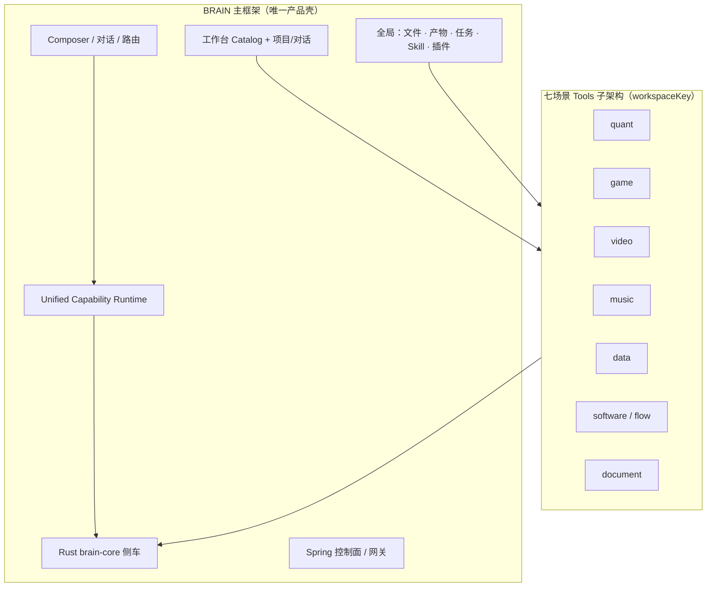

# BRAIN Scene Tools v1 — 七场景子架构（主框架延伸）

> Status: **approved baseline**  
> Parent: [brain-product-architecture.md](./brain-product-architecture.md)  
> Related: [workspace-architecture.md](../product/workspace-architecture.md), [unified-capability-runtime-v1.md](./unified-capability-runtime-v1.md)

## 0. 定位（一句话）

**BRAIN 是主框架；七个工作台是挂载在同一框架上的 Tools 子项目 / 子架构。**  
它们共享对话、项目、文件、产物、任务、Rust Core 与能力运行时，各自扩展专业面板、IPC、确定性操作与外部工具链。



---

## 1. 主框架层（所有场景不得重复实现）

| 层 | 职责 | 典型路径 |
|----|------|----------|
| **Renderer** | React UI、工作台切换、Composer | `shared/apps/desktop/src/renderer/` |
| **Main IPC** | 校验、审批、调用 Rust / agentd | `brain-workspace-ipc.ts`, `index.ts` |
| **本地元数据** | 项目、对话、草稿、章节 | `brain-workspace-storage.ts` (SQLite) |
| **Rust Core** | 沙箱写盘、进程、Git、文档 worker | `rust/brain-core/` |
| **Capability Runtime** | instruction / builtin / process / mcp | `shared/apps/agentd/` |
| **协议** | 跨层 DTO、IPC channel | `shared/packages/protocol/` |
| **远程控制面** | 账号、模型路由、搜索 | Spring / 网关 |

**规则：** 场景子架构 **只能扩展**，不能复制主框架的安全、存储或对话模型。

---

## 2. 七场景 Tools 子架构（同级、异构）

每个 `brainWorkspaceKey` 是一个 **Tools 子项目**，具备统一骨架 + 专有扩展：

```text
工作台 (workspaceKey)
├─ 共享骨架（主框架提供）
│  ├─ 项目 / 对话 / 文件 / 产物 / 任务
│  ├─ Composer + BRAIN 协作
│  └─ 能力运行时路由
├─ 场景 UI（子架构）
│  ├─ 中心 Tab / 专业面板
│  └─ 场景 Composer 提示与 Skill
├─ 场景 IPC（子架构）
│  └─ brain:<scene>:* channels
├─ 场景 Rust ops（子架构，按需）
│  └─ <scene>.* operations in brain-core
├─ 场景本地状态（子架构）
│  └─ brain_workspace_section / 场景表 / timeline 等
└─ 场景 E2E（子架构）
   └─ test-electron-<scene>-workspace.mjs
```

| workspaceKey | 中文 | 主流对标 | 子架构文档 | Rust ops | 外部 Engine |
|--------------|------|----------|------------|----------|-------------|
| `quant` | 量化交易 | **问财/东财 AI + 富途模拟盘**（对话优先） | [brain-quant-runtime-v1.md](./brain-quant-runtime-v1.md) | `quant.*` | 行情网关 / 模拟账本 |
| **`game`** | **游戏制作** | **Unreal Engine 5**（+ Web/Godot） | [brain-game-runtime-v1.md](./brain-game-runtime-v1.md) | **`game.*`** | UE5 / npm / Godot |
| `video` | 视频制作 | **Runway / 可灵 / ComfyUI** AI 成片管线 | [brain-video-runtime-v1.md](./brain-video-runtime-v1.md) | `video.*` | **`video_generate`** + FFmpeg |
| `music` | 音乐创作 | **Suno / Udio / MusicGen** AI 成曲管线 | [brain-music-runtime-v1.md](./brain-music-runtime-v1.md) | `music.*` | **`music_generate`** + FFmpeg |
| `data` | 数据与决策 | **ChatGPT 数据分析 / Julius / Excel Copilot** | [brain-data-runtime-v1.md](./brain-data-runtime-v1.md) | `data.*` | Agent pandas + Rust 聚合 |
| `software` | 软件与自动化 | **Cursor / Claude Code + n8n AI Flow** | [brain-software-runtime-v1.md](./brain-software-runtime-v1.md) | `process.run` + agentd | shell / 编译器 / CI |
| `document` | 文档创作 | **NotebookLM / ChatPDF + Word Copilot 修订** | [brain-document-runtime-v1.md](./brain-document-runtime-v1.md) | `document.*` | document worker |

---

## 3. 子架构与 UE5 的关系（以 game 为例）

**UE5 架构是 game 场景的参考实现，不是 BRAIN 主框架架构。**

| 层级 | 归属 |
|------|------|
| BRAIN 主框架 | 全部七场景共用 |
| game Tools 子架构 | 策划 Tab、Cook、`.uproproject` 布局 |
| Unreal Engine 5 | game 场景调用的 **外部 Engine**（与 Web/Godot 并列） |

其他场景同样有「外部 Engine」概念：

- **video** → spring-app **`video_generate`** + FFmpeg 合成  
- **music** → spring-app **`music_generate`** + FFmpeg 混音  
- **quant** → 行情网关 + 模拟账本（**Composer 极简操作**）  
- **data** → Agent pandas 分析 + 侧栏图表（非 Jupyter 主路径）  
- **software** → Agent 改码 + 审批 **`process.run`** + Flow  
- **document** → Rust **document worker**（ingest / export）  
- **game** → UE5 Editor  

---

## 4. 扩展新能力时的判定（Checklist）

新增功能前先答：

1. **是否七场景共用？** → 进主框架（shared / rust-core 通用 op）  
2. **是否只属一个场景？** → 进该场景子架构（IPC + UI + 可选 `scene.*` op）  
3. **是否改变磁盘工程？** → 必须 `brain-core` + approval，禁止 Renderer/TS 直写  
4. **是否调用外部进程？** → `process` provider + 用户审批  
5. **是否仅 AI 文案？** → `instruction` + SQLite 草稿 → 显式 Cook/Export 落盘  

---

## 5. 与能力运行时的关系

```text
用户意图
  → BRAIN 主框架路由（工作台 / 项目）
  → 当前场景 Tools 子架构（面板 + 章节 + 场景 Skill）
  → Unified Capability Runtime 选 provider
  → builtin: brain-core <scene>.* 或 agentd workspace 工具
  → process: FFmpeg / UE Editor / npm dev server
  → 产物写入项目目录 + 登记 artifact
```

场景子架构 **注册** 可发现的能力；主框架 **执行** 审批与隔离。

---

## 6. 交互原型对齐与交付顺序

交互原型（`spring-app/docs/prototypes`）是七场景 **右栏 Tools UI 合同** 的来源。  
完整映射、Chrome 规则、Rust 模块地图与 **前端先行 / Rust 后置** 阶段见：

→ **[brain-scene-prototype-alignment-v1.md](./brain-scene-prototype-alignment-v1.md)**

摘要：

1. 右栏顶栏只保留 **文件 / 产物 / 任务**；禁止单标签空导航条。  
2. 有多步的场景才保留次级 Tab（video 成片步骤、software Diff/终端/Flow 等）。  
3. **P1** 只改 `shared` Renderer（本地 state）；**P2** 再接 Rust `scene.*` + IPC。

---

## 7. 文档索引

| 文档 | 范围 |
|------|------|
| [brain-product-architecture.md](./brain-product-architecture.md) | 产品总边界、安全、Rust Core |
| [workspace-architecture.md](../product/workspace-architecture.md) | 七工作台产品定义与路线 |
| **本文** | 主框架 vs 七场景 Tools 分层 |
| [brain-scene-prototype-alignment-v1.md](./brain-scene-prototype-alignment-v1.md) | **原型 → UI → Rust 阶段合同** |
| [brain-game-runtime-v1.md](./brain-game-runtime-v1.md) | **game** 场景 |
| [brain-video-runtime-v1.md](./brain-video-runtime-v1.md) | **video** 场景（AI 视频生成） |
| [brain-music-runtime-v1.md](./brain-music-runtime-v1.md) | **music** 场景（AI 音乐生成） |
| [brain-quant-runtime-v1.md](./brain-quant-runtime-v1.md) | **quant** 场景（对话优先） |
| [brain-data-runtime-v1.md](./brain-data-runtime-v1.md) | **data** 场景（AI 数据分析） |
| [brain-software-runtime-v1.md](./brain-software-runtime-v1.md) | **software/flow** 场景（AI Agent 开发） |
| [brain-document-runtime-v1.md](./brain-document-runtime-v1.md) | **document** 场景（AI 文档修订） |
| [unified-capability-runtime-v1.md](./unified-capability-runtime-v1.md) | 能力 provider 合同 |

---

**Version:** `brain-scene-tools-v1`
