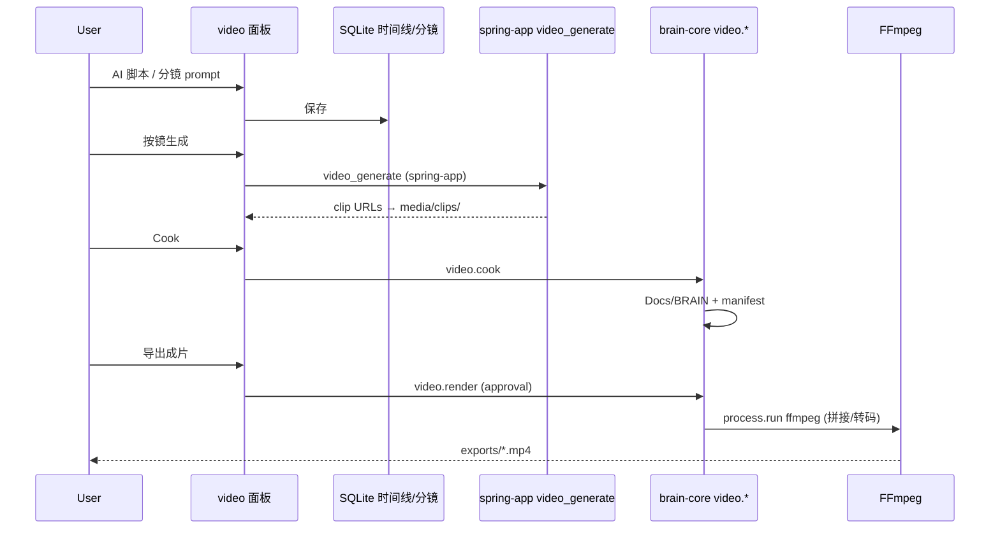

# BRAIN Video Runtime v1 — 视频场景 Tools 子架构

> Status: **approved baseline** for **video 场景 Tools 子架构**  
> Parent: [brain-scene-tools-v1.md](./brain-scene-tools-v1.md)  
> Related: [brain-game-runtime-v1.md](./brain-game-runtime-v1.md)（同级模板）

## 0. 在 BRAIN 中的位置

```text
BRAIN 主框架
└─ 七场景 Tools 子架构
   └─ video（视频制作, workspaceKey = "video"）   ← 本文档
      ├─ 继承：项目 / 对话 / Composer / Rust Core / 能力运行时
      ├─ 扩展：素材 / 脚本 / 分镜 / 时间线 / 字幕 / 导出
      └─ 外部 Engine：spring-app **`video_generate`**（主）· FFmpeg 合成/导出 · 可选本地 ComfyUI
```

| 层 | 路径 | 说明 |
|----|------|------|
| 主框架 | `WorkspaceModules.tsx` | `brainWorkspaceKey === "video"` |
| video UI | `VideoWorkspace.tsx`, `VideoStoryboardPanel.tsx`, … | 专业 Tab |
| video IPC | `brain:video:*` | `brain-workspace.ts` |
| AI 生成 | `media-generation-gateway.ts` | spring-app Auto **`video_generate`** |
| 合成 Engine | `video-render-service.ts` → **`process.run`** | Rust 调 FFmpeg 拼接/转码 |
| 规划 Rust 模块 | `rust/brain-core/src/video/`（待建） | `video.*` 统一前缀 |

**对标关系（AI 视频生成框架，非传统 NLE）：**

| 主流 AI 视频产品 / 框架 | 借鉴什么 | BRAIN 不做什么 |
|-------------------------|----------|----------------|
| **Runway Gen-3/4**、**可灵 Kling**、Luma、Pika | 单镜 clip 生成（`video_generate` 底层能力） | 不自建扩散模型训练 |
| **Coze 工作流**、剪映 AI 成片 | **节点编排**：成片级步骤 + **每分镜独立 workflow**（对标 Coze 视频制作节点） | 不嵌入 Coze 平台本身 |
| **ComfyUI / SVD** 工作流 | 节点式扩散管线（Engine 可选） | 不把 Comfy 整 UI 搬进桌面 |
| **剪映/CapCut AI** | 脚本 → 分镜 → 自动配音字幕 → 一键成片 | 不做移动端轻剪辑全功能 |
| **FFmpeg** | 多 clip **mux / 转码 / 字幕烧录**（合成层） | 不做调色/VFX 专业台 |

BRAIN video = **AI 生成编排壳 + 项目 Cook + FFmpeg 合成**；Premiere/DaVinci 仅可选 `launch_external`，不是主对标。

---

## 1. 参考模型（AI 视频生成管线抽象）

| AI 视频框架概念 | video 子架构 | 持久化 |
|-----------------|--------------|--------|
| Creative brief / Prompt | 脚本 Tab + 对话 | SQLite section |
| Shot list / Storyboard | 分镜 Panel：**每镜一条 Coze 风格 workflow**（节点可不同） | SQLite → Cook → `storyboard.json` + 每镜 `workflow.json` |
| Per-shot transition | **镜间转场**在分镜切换处设置（硬切/淡入淡出/叠化/划像等）；合成只读取，不再临时加转场 | `shots/transitions.json` |
| Per-shot workflow | LLM 细化 →（可选）参考图 → `video_generate` → 质检 → 输出；**AI 可生成/修改节点图** | `Docs/BRAIN/shots/shot_N/workflow.json` |
| Clip generation job | **单镜生成** / **选镜重生成**；进度 0/N → N/N 后解锁合成 | 项目 `media/clips/` + artifact 登记 |
| Per-shot A/V tracks | 每镜独立**视频轨 + 音频轨**；可单独静音/替换/裁剪，也可**手动改**入出点、旁白、音量 | `shots/shot_N/timeline.json` |
| Timeline assembly | 全镜就绪后 `video.render` concat + 音轨混入 | SQLite / JSON 时间线 |
| Final mux / Export | `video.render` → FFmpeg；**可选格式** MP4(H.264/H.265) / WebM / MOV(ProRes) / GIF | `exports/*.{mp4,webm,mov,gif}` |
| Color grading / VFX | **不做** | 外部 NLE（可选 launch） |

---

## 2. 磁盘工程布局（Cook 后）

```text
{ProjectRoot}/
├── .brain-video/
│   ├── manifest.json          # Cook 哈希链
│   └── pipeline.json          # brain-video-runtime-v1
├── media/                     # 用户素材（源片）
├── timeline/
│   └── timeline.json          # Cook 导出（可选与 DB 双写停止后仅磁盘）
├── exports/
│   └── render-{id}.mp4        # 渲染产物
└── Docs/
    └── BRAIN/
        ├── script.md
        ├── storyboard.json
        ├── shots/
        │   ├── shot_001/workflow.json
        │   ├── shot_001/script.md
        │   ├── shot_001/prompt.txt
        │   ├── shot_001/char.png          # 角色参考（上传或 AI）
        │   ├── shot_001/scene.png         # 场景参考（上传或 AI）
        │   ├── shot_002/workflow.json
        │   └── shot_003/workflow.json
        ├── subtitles.srt
        └── manifest.json
```

**原则：** 时间线/分镜在 SQLite 为 **Editor 草稿**；**Cook** 后写入 `Docs/BRAIN` + manifest，与 game 场景同构。

---

## 3. Rust `video.*` 操作目录（目标态）

| Operation | 审批 | 现状 | 说明 |
|-----------|------|------|------|
| `video.inspect` | 否 | 部分（ffprobe 散落） | 素材时长、编码、分辨率 |
| `video.cook` | 是 | 未统一 | sections → `Docs/BRAIN` + manifest |
| `video.render` | 是 | **已有** `VideoRenderService` + `process.run` | 归口为 `video.render` |
| `video.probe` | 否 | 部分 | ffprobe 结构化输出 |
| `video.subtitle_shift` | 是 | TS utils | 归口 Rust |

今日渲染已走主框架 Rust Core；**P1** 将 `VideoRenderService` 声明为 `video.render` 的 Main 适配层，**P2** 逻辑下沉 `rust/brain-core/src/video/`。

---

## 4. 数据流



---

## 5. 与能力运行时

| 意图 | Provider |
|------|----------|
| 写脚本/分镜 | instruction → SQLite |
| **按镜生成视频** | spring-app **`video_generate`**（`media-generation-gateway`） |
| Cook | builtin `video.cook` |
| 拼接/转码/字幕 | process `video.render` → FFmpeg |
| 搜 B-roll 素材 | instruction + 搜索网关 |

---

## 6. 实施阶段

| Phase | 交付 |
|-------|------|
| P0 ✅ | 本文 + `brain-video-runtime.ts` 协议 |
| P1 | `video.cook` Rust + UI 按钮 |
| P2 | `video.inspect/probe` 归口 Rust |
| P3 | 渲染完全声明为 `video.render` |
| P4 | 分镜 → **每镜 workflow** → 按节点跑 `video_generate` + artifact 登记 |
| P5 | 可选 `video.launch_external`（Premiere/DaVinci，非主路径） |

---

**Version:** `brain-video-runtime-v1`
