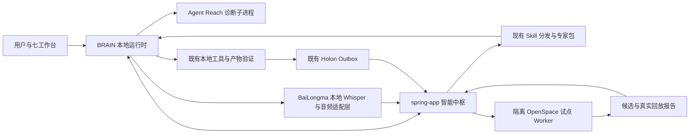

# BRAIN 下一版本方案：由 spring-app 管理的开源能力集成

日期：2026-09-05。状态：方案草案，尚未实施或运行验收。版本代号：N1，不修改现有产品版本号。

可交互界面原型：[视频音频工作台 v1](../prototypes/brain-video-audio-workspace-v1.html)。原型用于体验信息架构和状态流，不调用真实生成服务。

## 1. 版本目标与边界

spring-app 是智能中枢，负责能力目录、任务协调、模型路由、Skill 发布和质量决策；BRAIN 是桌面交互与本地执行端，保留必要的本地 Agent 循环、工具权限检查、执行日志和断线缓存。中枢定位不意味着把每次本地工具调用都改成远程调用。

N1 的用户价值：使用可追溯的现成专家与 Skill 完成任务，产物能够验证；失败记录能进入中枢，驱动受控的 Skill 改进。

直接复用指保留、调用或分发上游实际代码/内容，并记录原始版本和适配差异。仅重写其思想不计入本版本的开源集成成果。

核心范围：Agency 专家内容包、女娲 Skill 包、Agent Reach 诊断组件、BaiLongma 音频能力包、真实交付证据和两端恢复链路。OpenSpace 纳入有明确退出条件的后台试点。Game Studios 和 Codex 为后续扩展。BaiLongma 的完整桌面壳、主循环、账号和数据库不并入 BRAIN。

首发验收平台为 Windows 已安装 MSI；服务端采用正式 Compose 配置。七工作台保留，首批完整验收集中在软件、文档和视频任务，视频场景必须完成“逐镜头旁白生成→字幕转写→背景音乐→时间线混音→成片验证”。游戏仅做流程包适配验证。

## 2. 联合代码阅读结论

以下均为工作区代码事实，不代表已部署行为或已通过测试。BRAIN HEAD 为 68c311b6b88d，spring-app HEAD 为 1af2f75ed929；两仓库均有现存未提交修改，本方案按工作区阅读。

| 代码事实 | N1 决策 |
|---|---|
| Spring `DesktopSkillDistributionController` 已有 manifest、updates、download、delta；下载返回 SHA256 且检查 revoked | 复用分发协议，不新增第二个 Skill 下载平台 |
| Spring `GrowthV1Controller` 已有流程、实例、lease、Skill、memory、connector API | 复用现有流程和租约机制，接入前补并发及归属测试 |
| Spring `DesktopHolonFeedbackController` / `HolonRuntimeFeedbackService` 已支持幂等反馈、版本聚合和回滚 | 外部评测映射到现有 Holon 版本与反馈，不再做独立生产版本表 |
| BRAIN `holon-control-plane-service.ts`、`holon-outbox-service.ts` 已有任务领取、心跳、事件批量上传、重试、隔离 | 复用 outbox，验证并补齐所需证据事件 |
| BRAIN `expert-marketplace.ts` 已有专家/团队 manifest 与安装注册；`skill-expert-binding.ts` 规定 Skill 驱动召唤 | 增加导入转换器，保留已有召唤路径 |
| Spring `AgentTurnService` 用 ConcurrentHashMap 保存 turn、幂等索引、审批和事件；注释明确重启不恢复 | 新版本发布阻断项：补持久化并验证恢复，不宣称当前已具备服务端重启恢复 |
| Spring `HolonSkillEvaluationService:74` 在样本非空时赋固定 0.96；逐案例写 PASSED | 改为真实行为证据；无执行记录为未评测，不能显示通过 |
| 上述评测通过后 `HolonLearningPipelineService` 进入 REVIEW_REQUIRED | 已有审核关口需要保留；不能据此声称候选已自动上线 |
| `CentralSkillExecutionService` 只硬编码 government-research-writing | 外部包不能仅复制到目录就假定中枢会自动路由和执行 |
| BRAIN `parseOpenClawSkillFrontmatter` 逐行匹配，女娲 description 使用 YAML 多行块 | 导入链路必须验证多行描述，避免把描述解析成字符 `|` |
| BRAIN 已有逐镜头音频绑定、MiniMax TTS、本地 Kokoro、音量关键帧和 FFmpeg 多轨混音 | 保留 BRAIN 时间线与渲染主链；BaiLongma 用于补充音频生成和识别提供商，不重建编辑器 |
| BaiLongma 已实现豆包/MiniMax/OpenAI/ElevenLabs/火山 TTS，本地 Whisper 与多家云 ASR，以及 MiniMax `music-2.6` | 锁定上游代码并拆成 TTS、ASR、音乐三个适配包；凭证、套餐、路由和计费仍由 Spring 统一管理 |

## 3. 秘密花园项目逐项集成决定

本地 Git commit 为本次评审锁定候选，交付包还需记录文件 SHA256；`git status -uno` 未发现这些上游仓库的已跟踪文件修改，但未据此审计未跟踪文件。许可证是本地文件观察，实际交付应保留相关声明并检查所选依赖和资源。

| 项目 / commit | 直接使用的对象 | 接入方式 | N1 决定 |
|---|---|---|---|
| agency-agents / af128a92888f / MIT | 角色 Markdown 原文 | Spring 转换为现有 Skill 资产和 BRAIN ExpertPackManifest | 正式纳入；先选 4 个角色 |
| nuwa-skill / fe0374687037 / MIT | SKILL.md、references、必要模板 | 保留上游正文，增加 BRAIN 路径/工具映射与打包元数据 | 正式纳入；生成包先进入候选态 |
| agent-reach / da5044d26fc6 / MIT | Python doctor、probe、channel 代码 | Windows 受管 Python 子进程调用结构化 doctor；结果交给中枢选择能力 | 正式纳入诊断，限已安装的受支持渠道 |
| OpenSpace / 38277815ed44 / MIT | 实际 search/fix 与行为评测引擎 | Spring 管理的隔离 Python worker，MCP 或窄适配器调用 | 后台试点；不得自动改生产 Skill |
| Claude-Code-Game-Studios / 984023ddac0d / MIT | quick-design、story-done 及依赖的模板/规则 | 内容包加工具映射、项目目录模板 | N1 扩展验证，不阻塞核心发布 |
| codex / 459a79eb8540 / Apache-2.0、NOTICE | TypeScript SDK + Codex CLI | BRAIN 本地软件任务执行器，经 Spring 网关调用模型 | 后续可选执行器，本版不替换现有 Agent |
| BaiLongma / b20f4ad5d164 / MIT | `voice/tts-providers.js`、`media/speech.js`、`voice/cloud-asr.js`、本地 Whisper、`providers/minimax.js` 中音乐实现 | 保留上游文件和许可证，以窄适配器接入 Spring 能力目录及 BRAIN 视频工具；不引入完整运行时 | 正式纳入音频能力包；逐项真实验收后启用 |
| andrej-karpathy-skills / 2c606141936f | 行为指导内容 | 当前用户规则已覆盖主要内容，根目录未见 LICENSE | 不作为内置再分发包 |
| Anthropic 提示词指南目录 / 无独立 Git 标识 | 文档 | 未见本目录许可证，模型描述未核验 | 不作为产品内置资源 |

上游公开入口：[Agency](https://github.com/msitarzewski/agency-agents)、[Agent Reach](https://github.com/Panniantong/Agent-Reach)、[OpenSpace](https://github.com/HKUDS/OpenSpace)。本次打开页面辅助核对项目身份；集成判断以本地锁定代码为准，不以远端 main 自动更新。

### 3.1 Agency：真正导入专家内容

首批选 `engineering-code-reviewer`、`engineering-backend-architect`、`testing-api-tester`、`testing-reality-checker`。保留原始文件与 MIT 声明；中文展示名、场景、Skill 绑定、工具依赖写入独立适配元数据。

上游角色 Markdown 不是 BRAIN 专家包，不能直接复制后声称可执行。构建转换器应产出 Spring `asset.json`、`skill/SKILL.md` 和符合现有 ExpertPackManifest 的展示/团队信息；若现有分发器不接受专家资源，再补版本化资源字段。

专家权责和步骤保留上游内容；工具名、目录名、模型名称等宿主差异由明确映射处理，并保留差异清单。角色文本不能授予额外权限。

验收：一次安装后可由已启用 Skill 触发专家；离线可读取已缓存包；无效角色名、重复安装、撤销版本均有确定行为；结果能关联到确切内容 hash。

### 3.2 女娲：直接使用生成流程，但由中枢发布

输入人名、主题或本地材料，执行上游调研/提炼/评分流程，输出候选 Skill、来源说明与评测报告。先使用测试资料验证，不承诺任意人物均能形成可靠专家。

需要补齐 YAML 多行描述、references 相对路径闭包、`.claude/skills` 输出路径映射、工具和委派映射。允许的模型由 Spring 现有授权与路由决定，不把上游写死的模型偏好当权限。

生成物写隔离候选目录，经现有审核/版本体系发布，不覆盖用户原有 Skill。评分报告中的“人物像不像”与“任务完成质量”分开，不能用前者替代后者。

### 3.3 Agent Reach：本版直接用诊断，不冒充采集平台

已确认 `integrations/mcp_server.py` 只导出 `get_status`；`core.py` 明确阅读/搜索由 gh、yt-dlp 等上游工具执行。其 MCP 错误提示引用的 `[mcp]` extra 与 pyproject 中现有 extras 也需核对，不能照抄安装指令。

选用 Python API `AgentReach(...).doctor()` 的结构化结果，外层封装稳定 JSON schema。使用固定 Python 3.12 与锁定 wheel/dependency 清单，避免首次聊天触发联网 pip 安装。上游要求 Python >=3.10。

N1 先探测已有 GitHub CLI 和网页相关能力；是否显示可用必须由真实探测决定。渠道缺失只返回不可用及安装入口。浏览器 Cookie 保留在本机；诊断摘要可回传，Cookie 不回传。

若要增加具体阅读能力，单独登记上游工具和许可证，并完成业务请求验收；不把 Agent Reach 支持列表等同于 BRAIN 已支持列表。

### 3.4 OpenSpace：调用实际代码的受控试点

上游支持 MCP search_skills、fix_skill 等；`fix_skill` 会注册目录、产生 TriggerJob 并驱动演化，不是无副作用的纯评测 API。`behavior_eval.py` 明确区分合同、路由、回放检查，回放需要外部 runner。安装 OpenSpace 并不会自动补齐 BRAIN 的真实评测。

部署 Python >=3.12 的独立 worker，以 Compose profile 管理。Spring 只向任务隔离目录投放 Skill 副本和最小必要证据；worker 可改变副本，不能挂载生产 Skill 目录或读取生产数据库凭据。禁用公共云同步、自动上传和无人监管的后台演化路径，具体开关和网络限制作为试点验证项。

Spring 适配器调用上游搜索/修复流程，返回候选文件、hash、来源任务和上游报告；BRAIN 或隔离测试 runner 执行旧版/候选版相同用例，产物检查结果回传到 Holon。Spring 是最终发布与活动版本指针的唯一所有者。

试点通过条件：真实完成一次失败样本→候选修复→基线/候选回放→报告→审核→发布→回滚。若私有部署、依赖或回放合同无法在试点中稳定跑通，N1 核心版关闭该 profile，保留现有 Skill 发布，禁止把假评测回退成通过。

### 3.5 BaiLongma：直接接入音频能力包，不引入第二套运行时

直接纳入以下锁定源文件及其必要依赖闭包：

- `src/voice/tts-providers.js`：豆包、MiniMax、OpenAI TTS、ElevenLabs、火山引擎的统一调用和音色清单。
- `src/capabilities/tools/media/speech.js`：Markdown 清理、音色校验、空音频判定、瞬时错误重试和可操作错误分类。
- `src/voice/cloud-asr.js`：阿里云、腾讯云、讯飞、火山引擎实时 ASR；本地识别使用 `src/voice/whisper_server.py` 及所需 Whisper 文件。
- `src/providers/minimax.js` 中 `music-2.6` 的 `/music_generation` 实现：作为 Spring 音乐能力候选适配器，不绕开现有 `music_generate`。

集成时保留上游 MIT LICENSE、commit、源文件 hash 和适配差异。公共合同与跨平台逻辑放 BRAIN `shared/`；Windows Python/Whisper 进程和打包差异放 `platforms/windows/`。外部服务凭证不得复制到 BaiLongma 配置或 BRAIN 普通设置文件，应复用 Spring 现有凭证、套餐授权、模型能力目录和计费链路。

视频场景新增统一音频请求：文本、语言、providerHint、voiceId、语速、情绪、projectId、shotId 和 idempotencyKey。Spring 决定外部提供商并返回任务状态；BRAIN 负责把结果保存为镜头专属版本，写入现有 `BrainVideoShot.audio` / 音频轨道，并通过 Holon outbox 上报真实产物证据。本地 Whisper 属 BRAIN 本地能力，不把原始音频默认上传给 Spring。

生成链路：逐镜头旁白可试听、重生成和切换版本；导入音频/视频可转写为带时间信息的字幕草稿；MiniMax 可生成纯音乐或带歌词歌曲并进入现有媒体库/时间线。音乐生成仍走 `music.song.generate` / `music_generate`，不新增 `bailongma.music` 这种平行用户工具。

本版混音补充自动旁白闪避、响度标准化和削波/静音检测；这些不是 BaiLongma 已有能力，应在 BRAIN 现有 FFmpeg 渲染链中实现并明确标为 BRAIN 新增代码。BaiLongma 的本地音乐下载、歌词抓取和播放器不进入核心范围，以免引入来源合规、自动下载和第二套媒体库问题。

启用门槛：每个云服务商分别用真实账号完成凭证错误、配额错误、超时、空音频和成功音频检查；产物需验证 MIME/容器、可解码、时长非零、采样率和声道。ASR 需检查断线重连、重复分段和时间戳；音乐需检查异步状态、重复提交与计费幂等。未验收的 provider 保持不可选，不因代码存在就显示“可用”。

### 3.6 Game Studios 与 Codex 的扩展门槛

Game Studios：`story-done` 引用了 Task、AskUserQuestion、Bash、.claude/docs、production 和 GDD/ADR 文件。必须解析传递引用、提供项目模板，并映射到 BRAIN 实际工具。其 validate-skill-change hook 仅提醒，不能作为强制门禁。模板适配成功不代表 UE5 自动开发已经成功。

Codex：SDK 通过 CLI 子进程工作，支持 baseUrl、apiKey、流式事件、工作目录与取消信号；这些参数存在不代表兼容 Spring 所有模型。下一阶段先验证 Spring 网关协议、工具事件、鉴权、计费归属、取消和恢复，成功后才提供可选执行器。保留 Apache 声明及 NOTICE，原生 CLI 需检查 MSI 内实际可执行。

## 4. 两端职责与数据流

spring-app 管：租户、授权、模型网关、任务协调、包版本、活动指针、评测汇总与发布。BRAIN 管：本机路径、子进程、用户操作、工具执行事实、产物检查和未确认上报队列。外部运行时管隔离任务内部状态，不成为第三个生产任务主库。

复用 AgentTurn、Growth、Holon 各自已有实体；先建立 project/thread/turn/work-item 对应关系与职责，再持久化易失状态，避免直接合并三套模型造成大范围迁移。租约续期和过期写入必须有条件更新及并发测试，API 存在不代表实现已满足互斥要求。

## 5. 最小新增合同（设计字段，尚未实现）

1. 上游来源：sourceRepo、commit、licenseFiles、sourceHash、adapterVersion、outputHash。每个包一份锁定记录。
2. 任务关联：owner 从服务端认证派生，projectId/threadId/turnId/workItemId 显式关联；禁止信任客户端传入的 owner。
3. 交付证据：eventId、toolCallId、skillKey/versionHash、artifactRef/hash、validatorId/version、result、errorClass。原始大文件留本地，按授权上传必要内容。
4. 评测结果：passed/failed/not_evaluated/infrastructure_error 分开；固定模型配置、基线与候选 hash、案例输入、产物断言和消耗记录。
5. 诊断状态：checkedAt、deviceId、capabilityId、backend、status、reasonCode。带时间有效性，不把一次健康结果永久缓存。
6. 音频任务：audioJobId、projectId、shotId、kind（narration/transcription/music）、provider、voiceId、sourceHash、outputHash、durationMs、sampleRate、channels、status、errorCode 和 idempotencyKey。
7. 视频混音证据：旁白/BGM 版本、时间线位置、音量包络、目标响度、峰值、静音区间、渲染命令摘要和最终成片 hash。不得持久化服务商密钥。

优先扩展现有 Holon 事件、反馈和 Skill manifest；新增字段需版本化、旧客户端兼容测试。未检查客户端与服务端完整 schema 前不承诺可以零改动承载。

## 6. 实施顺序、负责人职责与估算

以下为工程工作量粗估，含适配与定向测试，不是工期承诺；实施人员配置和外部模型稳定性尚未确认。

| 阶段 | 交付 / 主要路径 | 估算 | 放行依据 |
|---|---|---|---|
| A 基线修正 | Spring AgentTurn 持久化；Holon 评测去掉固定分数；BRAIN 事件关联 | 4–7 人日 | 服务重启、重复请求、归属隔离、未评测状态通过 |
| B 内容包导入 | Spring SkillAsset/Distribution；BRAIN expert-marketplace 与 frontmatter 适配 | 4–6 人日 | 4 个 Agency 角色与女娲包完整导入、撤销、回退 |
| C 桌面诊断与交付 | Agent Reach 子进程适配；BRAIN 产物验证与 Holon outbox | 3–5 人日 | MSI 中真实诊断、真实文件检查、断网补传 |
| D BaiLongma 音频包 | TTS/ASR/音乐适配、逐镜头版本、字幕、自动闪避与音频验证 | 5–8 人日 | 真实 provider、真实音频、时间线混音和成片验收通过 |
| E OpenSpace 试点 | Spring adapter、Compose worker、回放 runner 与 Holon 报告映射 | 5–8 人日 | 受控演化完整链路；不满足则试点关闭 |
| F 发布验收 | 两仓库构建、远端请求、已安装 MSI、升级回归 | 3–5 人日 | 下表所有核心发布项通过 |

核心 A+B+C+D+F 约 19–31 人日，包含 OpenSpace 试点约 24–39 人日。Game Studios/Codex 完整集成不计入核心估算。服务端、桌面、音频集成和独立 QA 分别负责实现与验证；具体人员由实施安排确定。

## 7. 发布验收清单

| 编号 | 场景 | 可检查的结果 |
|---|---|---|
| N1-01 | Agency 包导入、安装、Skill 触发 | 专家身份和 Skill hash 对应；不是只新增一张卡片 |
| N1-02 | 女娲生成测试主题 Skill | 来源及 references 完整，输出为候选，未经审核不替换活动包 |
| N1-03 | YAML、多层相对引用、重名包 | 描述正确；依赖闭包完整；冲突有明确处理 |
| N1-04 | 诊断缺失或损坏的工具 | 返回明确失败原因，无假健康、无自动联网安装 |
| N1-05 | 真实软件/文档任务 | 实际 diff/测试或可打开文档与验收报告对应 |
| N1-06 | Spring 在执行中重启 | 恢复任务/审批/幂等状态；未决副作用不盲目重跑 |
| N1-07 | BRAIN 断网、退出、重启 | outbox 可补传，同事件不重复计入质量 |
| N1-08 | 两设备竞争、取消、过期租约 | 唯一有效执行归属，过期完成被拒绝，子进程能取消 |
| N1-09 | 错误或未执行的评测 | 不能得到固定高分或 PASSED；无环境不算 Skill 行为失败 |
| N1-10 | 用户 A 请求用户 B 的任务/包/证据 | 服务端拒绝，不能仅验证 scope 而遗漏对象归属 |
| N1-11 | 新包撤销、升级失败 | 活动指针和缓存回到已验证版本，运行中任务保留原版本 |
| N1-12 | OpenSpace 试点 | 真实回放旧版/候选；工作目录隔离；worker 故障不阻塞普通任务 |
| N1-13 | 正式交付 | Spring 实际 token-bearing 业务请求通过；新 MSI 安装后完整执行通过 |
| N1-14 | 三个不同镜头生成旁白 | 每个镜头绑定自己的音频版本；重生成一个镜头不污染其他镜头 |
| N1-15 | BaiLongma TTS provider 验收 | 已启用 provider 返回可解码非空音频；错误凭证、配额和超时产生稳定错误码 |
| N1-16 | 本地/云端 ASR 转字幕 | 时间戳、断线续传和重复分段处理正确；本地模式不上传原始音频 |
| N1-17 | 背景音乐进入视频时间线 | `music_generate` 只计费一次，结果可试听、裁剪、调音量并参与最终渲染 |
| N1-18 | 视频自动混音 | 旁白期间 BGM 自动降低；最终文件通过响度、削波、静音、时长和音画同步检查 |

测试分层：Java 服务与真实数据库持久化测试；BRAIN 协议/子进程/SQLite 测试；集成合同测试；真实模型和真实产物；已安装 MSI。构建与 health 检查不能替代 N1-13。

发布分开控制 contentPacks、reachDiagnostics、bailongmaAudioProviders、localWhisper、openspacePilot（拟定开关名）。每个云音频 provider 还需独立启停。关闭试点不撤销已验证内容包；关闭某一音频 provider 不影响现有 MiniMax/Kokoro 路径。数据库迁移采用兼容增量；已有生产版本、用户本地资料和现存未提交修改必须保留。

## 8. 本次证据与未执行项

已执行：联合静态阅读相关 Controller/Service、桌面客户端/outbox/包解析器；上游入口/依赖/许可证文件检查；Git commit 与已跟踪修改检查；打开 3 个上游项目页面；安装 BaiLongma 锁定依赖并实际启动 2.2.120，确认本地 API、Electron 激活窗口、记忆初始化和语音唤醒进程可启动；定向阅读 BaiLongma 的 TTS、ASR、音乐生成代码和 BRAIN 现有视频音频链路。

未执行：BaiLongma 云 TTS/ASR/音乐的真实账号调用、本地 Whisper 转写验收、OpenSpace 回放、Java 构建、BRAIN MSI 打包、远端部署。因此“纳入”是建议范围，“兼容”仍必须通过上述验证；BaiLongma 启动成功不等于其音频 provider 已通过业务验收，本报告不授予发布通过结论。

关键本地证据入口（相对本文件）：

- [Spring 评测实现](../../../spring-app/src/main/java/com/demo/tokensystem/service/HolonSkillEvaluationService.java)
- [Spring Turn 实现](../../../spring-app/src/main/java/com/demo/tokensystem/service/AgentTurnService.java)
- [Spring 分发接口](../../../spring-app/src/main/java/com/demo/tokensystem/controller/DesktopSkillDistributionController.java)
- [Spring 学习流水线](../../../spring-app/src/main/java/com/demo/tokensystem/service/HolonLearningPipelineService.java)
- [BRAIN 专家包](../../shared/apps/desktop/src/main/expert-marketplace.ts)
- [BRAIN Outbox](../../shared/apps/desktop/src/main/holon-outbox-service.ts)
- [BRAIN Skill 解析器](../../platforms/windows/apps/desktop/src/main/openclaw-skill-package.ts)
- [BRAIN 视频音频绑定](../../shared/apps/desktop/src/renderer/app/video-pipeline-audio-resolve.ts)
- [BRAIN 视频混音](../../shared/apps/desktop/src/main/video-layered-ffmpeg.ts)
- [Agent Reach MCP](../../../秘密花园/agent-reach/agent_reach/integrations/mcp_server.py)
- [BaiLongma TTS providers](../../../秘密花园/BaiLongma/src/voice/tts-providers.js)
- [BaiLongma 语音生成工具](../../../秘密花园/BaiLongma/src/capabilities/tools/media/speech.js)
- [BaiLongma 云 ASR](../../../秘密花园/BaiLongma/src/voice/cloud-asr.js)
- [BaiLongma MiniMax 媒体 provider](../../../秘密花园/BaiLongma/src/providers/minimax.js)
- [OpenSpace 回放评测](../../../秘密花园/OpenSpace/openspace/skill_engine/evolution/behavior_eval.py)
- [OpenSpace MCP](../../../秘密花园/OpenSpace/openspace/entrypoints/mcp/server.py)
- [女娲 Skill](../../../秘密花园/nuwa-skill/SKILL.md)
- [Game Studios 完成检查](../../../秘密花园/Claude-Code-Game-Studios/.claude/skills/story-done/SKILL.md)
- [Codex SDK 执行入口](../../../秘密花园/codex/sdk/typescript/src/exec.ts)
